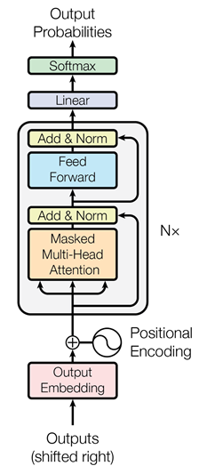

title: "Reading 1: Attention is all you need"
## Attention Is All You Need

The paper for our first reading is: [Attention is all you need](https://arxiv.org/pdf/1706.03762.pdf). I do NOT expect you to thoroughly read the required papers. Instead, I expect you to start from the reflection questions below and go into the papers to find your answers to the questions listed there.

Figure 1 below is modified to show the form of a decoder-only Transformer. The decoder-only architecture is the one used for ChatGPT and nearly every other chatbot and LLM today.

In addition to reading the paper,  you may wish to read or watch the animations in the Medium article, [Drawing the Transformer Network from Scratch](https://medium.com/towards-data-science/drawing-the-transformer-network-from-scratch-part-1-9269ed9a2c5e).  A couple of notes on this article: (1) While it talks about the encoder sublayer, in practice this is exactly the same architecture used in most transformers today, which are considered "decoder-only" networks. The only thing missing from the discussion are the final token-wise linear and softmax sublayers used to select words. (2) The article shows how each word embedding vector flows through the network.  It shows every operation on these vectors as they flow through the attention head.  This can make it easier to see how the network processes multiple tokens in parallel. (3) As far as I can tell, there is no part 2 even though this article is named part 1.  So for the final linear and softmax layers, you'll need to look elsewhere.  (Thanks to MSOE student Bart Gebka for sharing this medium article with me.)

(Optional aside: You may also enjoy watching the start of Welch lab's video, [How DeepSeek rewrote the Transformer](https://www.youtube.com/watch?v=0VLAoVGf_74), ending [here at the 7:10 mark](https://youtu.be/0VLAoVGf_74?t=430). The rest of the video is about K-V caching, which is a topic for _later_ in this course!)

Second, read through my article on [matrix multiplication and attention](../../text/attention.md). This discusses the three different interpretations of matrix multiplication used by the Transformer.

Third, run the [Gemma walk-through notebook](../../projects/gemma_walkthrough.md) through the B. Gemma Forward pass section.  In answering the questions below, you may wish to find the parts of this notebook that implement certain parts of the transformer to see an actual code implementation.

(optional) Consider the paper [A Study on ReLU and Softmax in Transformer](https://arxiv.org/pdf/2302.06461). Does it help you to understand the core Transformer operations better?

This paper does not define the concept of attention, which was already common in the literature before this point.  But it does define "scaled dot-product attention" which is the form of attention central to all Transformers, including ChatGPT, to this day.

**1. Define what we mean by *embedding* and give an example of what makes an embedding good.**

Consider again my article on matrix multiplication and attention, linked above.

**2. Describe the three ways Transformers use matrix multiplication to transform embeddings.**

**3. Describe, in equations or words, the core operations of Attention and Feed-Forward Layers found in a network.**

**4. Describe the general structure of a transformer -- what are its major components, and how are they connected?  What is a Layer?**

(optional) Explore the idea of temperature [with this interactive demo](https://blog.lukesalamone.com/posts/what-is-temperature/) and [this Stack Overflow post](https://stats.stackexchange.com/a/639665/80385)
