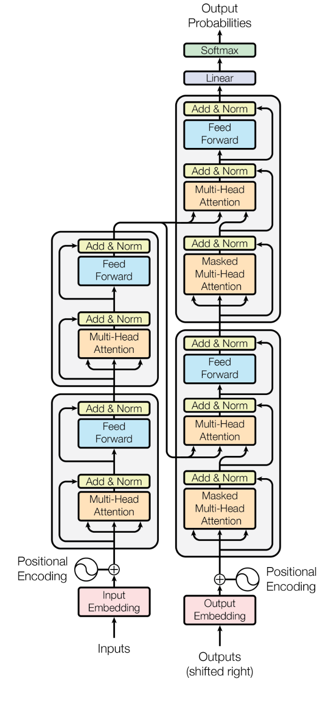

This term, we have primarily focused on self-attention which is the only attention used in the standard decoder-only architecture. Self-attention needs to include a causal mask (Section 3.2.3 of [Attention is all you need](https://arxiv.org/pdf/1706.03762)) so that the transformer doesn't "cheat" by looking at the tokens in the future that it is trying to predict.

But when trying to understand the importance of positional encoding, it can be helpful to consider cross-attention, which is simpler because it does not use this mask.  (Cross-attention is shown in Figure 1, where the keys and values come across from the encoder column to the decoder column, and the queries come up from lower in the decoder column.) In this figure, these non-masked attentions are shown in the left column. All the attention blocks in the right column are masked.

(In case it isn't obvious, this figure is slightly modified from Figure 1 in the Attention is All You Need paper, to emphasize that the basic transformer blocks are repeated N times. Here, N is shown as 2, but in the original paper, N=6, and modern transformers typically have dozens or hundreds of layers.)

Consider two different computations of cross-attention, *neither* of which use positional encoding: This is an English-to-Spanish translation encoder, and the two inputs are "the man bit the dog" and "the dog bit the man".  Both of these come in as inputs. Initially, the outputs start empty or with a "start of sequence token" but no text tokens.

Now, what happens when we switch between the two inputs, in a transformer that doesn't use positional encodings?  The two inputs have the same words, but in a different order. So they will use the same tokens in their first embedding within the residual stream, but with the rows in a different order. Perhaps something like this:

$\left[
    \begin{array}[cc]
    00.2 && -0.3 && 0.4 & ... \\
    0.3 && 0.3 && 0.3 & ...\\
    0.9 && 0.3 && -0.8 & ...\\
    0.2 && -0.3 && 0.4 & ... \\
    -0.1 && 0.1 && 0.1 & ...\\
    \end{array}
    \right]$

And the second input having the embedding:

$\left[
    \begin{array}[cc]
    00.2 && -0.3 && 0.4 & ... \\
    -0.1 && 0.1 && 0.1 & ...\\
    0.9 && 0.3 && -0.8 & ...\\
    0.2 && -0.3 && 0.4 & ... \\
    0.3 && 0.3 && 0.3 & ...\\
    \end{array}
    \right]$

How will these embeddings compare after going through the multihead attention mechanism?

The Q and K matrices will be the same except for the row order, so whey they are multiplied, they will get the same exact values, except for exchanging the rows for the man and dog columns. So, the output of softmax may be:

$\left[
    \begin{array}[cc]
    00.3 && 0.2 && 0 && 0.3 && 0.1 \\
    0.2 && 0.6 && 0 && 0.2 && 0 \\
    0 && 0 && 1 && 0 && 0 \\
    0.3 && 0.2 && 0 && 0.3 && 0.1 \\
    0.1 && 0 && 0 && 0.1 && 0.9 \\
    \end{array}
    \right]$

And, for the input with the tokens reordered:

$\left[
    \begin{array}[cc]
    00.3 && 0.1 && 0 && 0.3 && 0.2 \\
    0.1 && 0.9 && 0 && 0.1 && 0 \\
    0 && 0 && 1 && 0 && 0 \\
    0.3 && 0.1 && 0 && 0.3 && 0.2 \\
    0.2 && 0 && 0 && 0.2 && 0.6 \\
    \end{array}
    \right]$

Notice how these two attention matrices are the same except that both the dog and man columns **and** rows have both been swapped.

When this attention matrix is muliplied by the value matrix -- which also will have the "dog" and "man" rows swapped -- the output will again be the same, but with just those two rows swapped. For example, wherever the "man" token is, it will have an output embedding that is 0.6 of its own input mebedding, and $0.2+0.2=0.4$ times the embedding that the two "the" tokens share. Look at the second row of the first attention matrix and the last row of the second attention matrix and think about how those rows will be multiplied by the value matrix to see how this works.

So, when we don't use positional encoding, each token's embedding remains the same through all the layers, even attention, even though we shuffle the order. No matter where we put the token within the input sequence, it will have the same token embeddings at that location as it would anywhere else in the sequence. 

This property of attention (without positional encoding) is called permutation equivariance.

Because the attention mechanism is permutation equivariant, and all the other operations within a transformer operate on each token indepently, the entire transformer is also permutation equivariant.

If we consider what we know about how a transformer works, this isn't very surprising.  We know that the attention pattern links based on the values of the embeddings, not where they are within the input.  And we know that the blending of woards is based only on the attention links. So it is not surprising that changing the order of the words in a transformer won't change its output -- unless we include positional encodings!

Another way of looking at this is that attention *needs* positional encoding so the $Q K^T$ linkings can consider position and not just the meanings of individual tokens or words.
